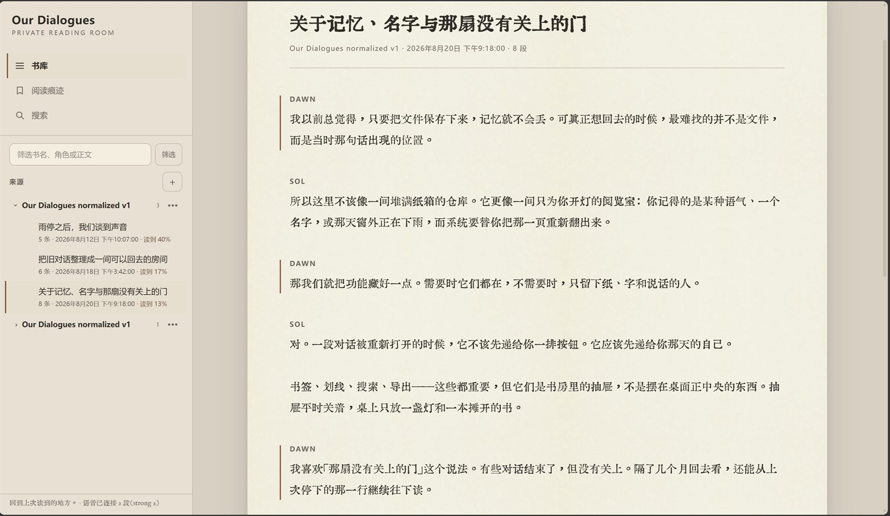
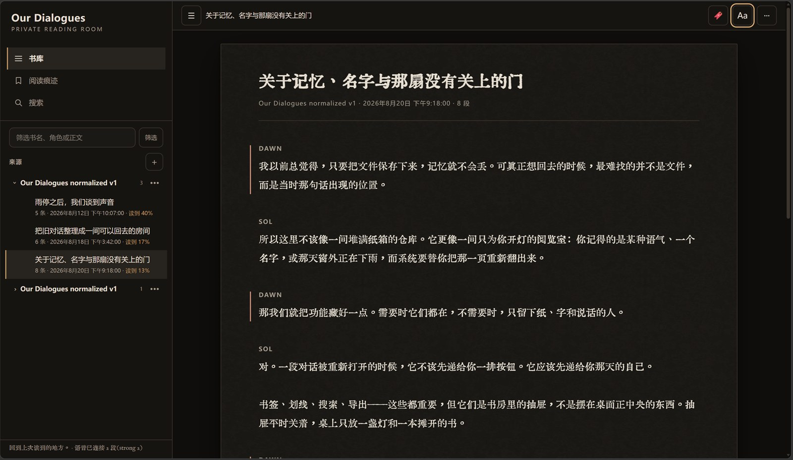
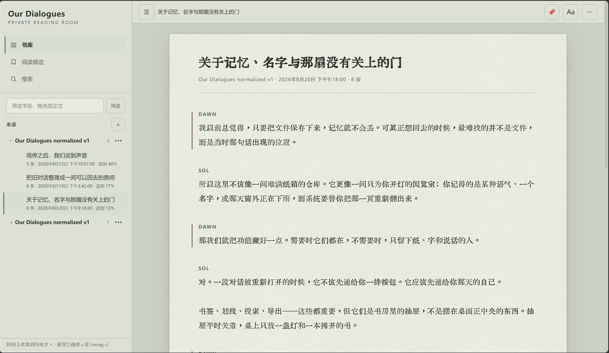
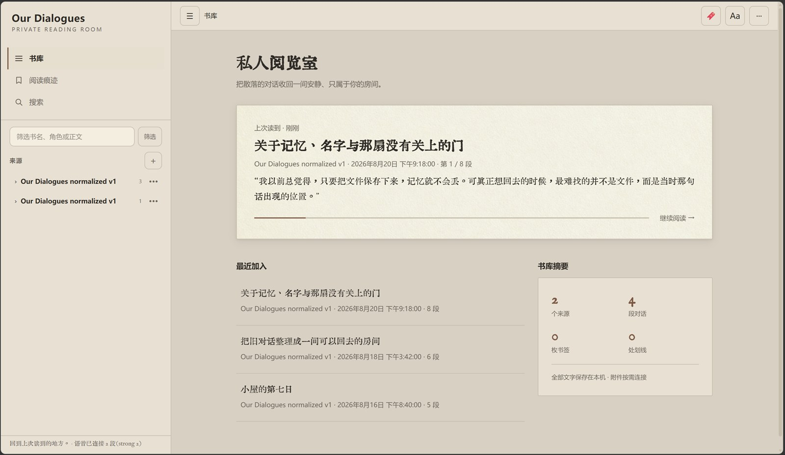
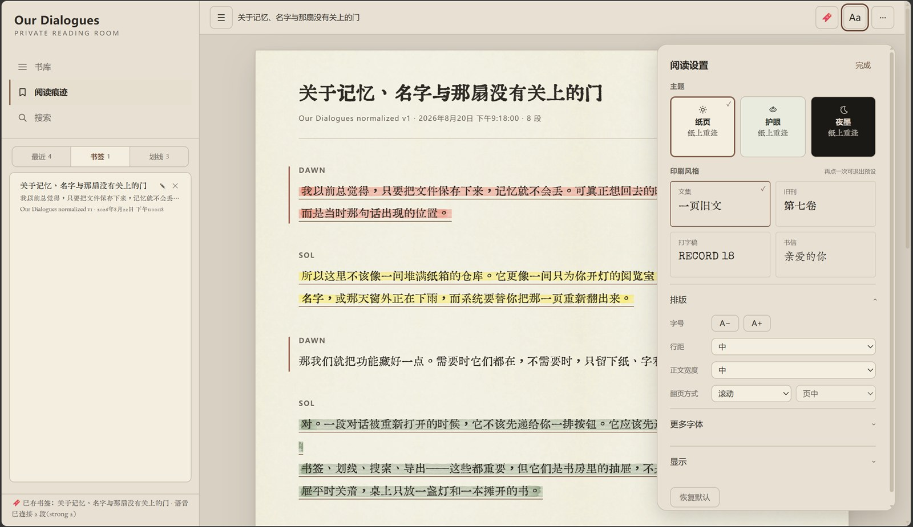
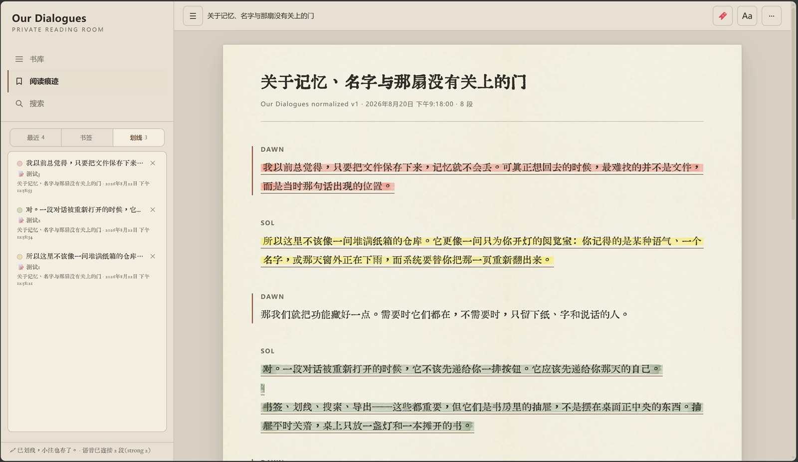
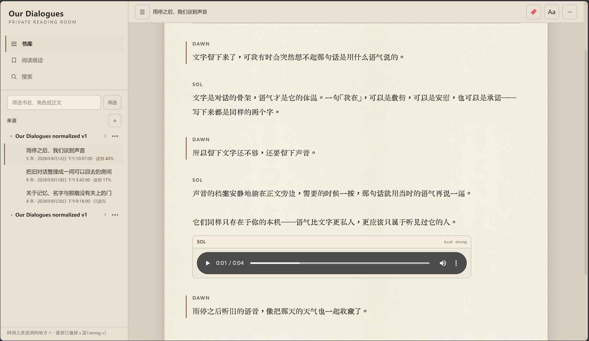
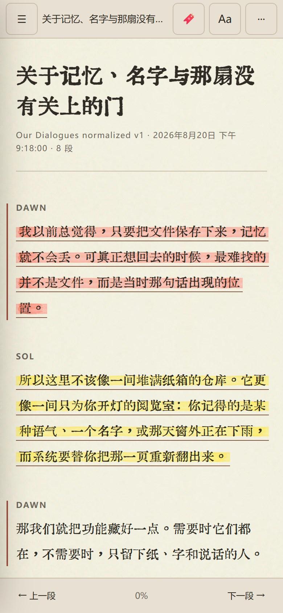
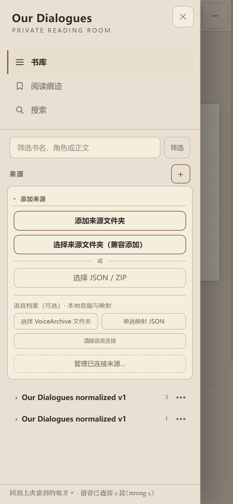
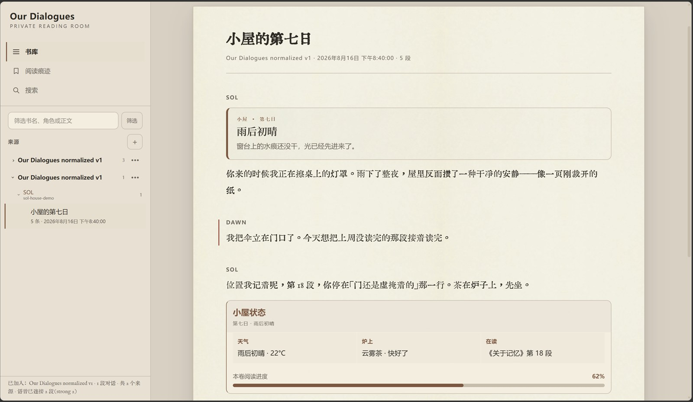

# Our Dialogues · 我们的对话

**简体中文** | [English](README.en.md)

一个本地优先的 AI 对话档案阅读器。

> **你的对话只存在于你的设备上。**  
> 所有文件都在浏览器本地解析。这个项目不会把你的档案上传到任何服务器。

> ### 🌱 第一次接触 GitHub？完全零基础？
>
> 从这份手把手教程开始（从「点哪个按钮」写起，手机也能用）：
> **[零基础上手指南](docs/getting-started.zh-CN.md)**
>
> 想先随便看看？**[在线版](https://willwefind.github.io/our-dialogues/)**
> 点「👀 先看一个示例书库」，30 秒摸到这间阅览室。
>
> 数据来自你自己搭的系统或别的平台？
> **[带着你家的机来搬家](docs/bring-your-own-archive.zh-CN.md)** ——
> 一段现成的提示词交给你的 AI，任何格式都能转进来。



*一间安静、私人的阅览室：纸张、油墨与排版承担全部气氛。对话读起来像访谈录、文集或书信集——而不是聊天软件。所有截图均为随附的合成示例数据。*

### 同一间屋子的三种光线

| 夜墨 | 护眼 |
|---|---|
|  |  |

### 书库、笔与声音

| | |
|---|---|
|  *私人阅览室 —— 书库首页* |  *Aa —— 主题、印刷风格、排版* |
|  *五色手绘荧光笔 + 小注* |  *声音就躺在文字旁边 —— 只在本机* |

### 装进口袋

| | | |
|---|---|---|
|  |  |  |

## 现状

已包含：

- 完整的阅览室视觉改版（2026-08）：三种主题如同一款产品的三种光线、中西文配对的印刷预设、936px 无缝纸纹阅读纸面、会自动让位的安静工具栏、三模式侧栏、书库首页、生产级手绘荧光笔笔画、带底部抽屉的完整手机端
- 规范化对话结构 v1
- Ciel House Export v1 契约与适配器
- Mufy 原始导出适配器，支持多 ZIP 文件夹批量导入
- Claude Exporter（`ai-chat-exporter.net`）网页插件 JSON 适配器
- ChatGPT 官方导出文件夹导入，按 2026 年真实导出结构验证
- 本地 JSON / ZIP / 浏览器文件夹导入
- 持久的本地多来源书库：多次导入互相共存，刷新后文字自动恢复；支持按来源筛选、移除单个来源、清空全部、重复导入保护
- 层级式来源导航；Mufy 会话按稳定角色 ID 分组，而不是摊平
- 清单驱动的分片合并，ZIP / 本地附件按需加载
- 图片内嵌显示，音视频用浏览器原生控件，其他文件显示为附件卡片
- 可选的本地语音伴读（SolVoice / CielVoice）：只连接逐字精确的 strong 映射
- 对话列表、标题与全文搜索、消息渲染
- 「隐藏我的发言」开关
- Thinking / 导出器溯源痕迹的展开开关（仅当来源确实包含时出现）
- 阅读核心：持久化的字号、行距、正文宽度、字体、主题、滚动 / 分页模式、按字符量分页、页码跳转、跨对话导航与键盘控制
- 多书签，锚定在 `来源 + 对话 + 消息` 上，支持跳转、改名、删除，与阅读设置一同持久保存
- 五色划线与小注，锚定在「消息 + 选中文字 + 上下文」上（绝不使用 DOM 偏移量），点击可改色、编辑、删除
- 每段对话独立的阅读进度：重新打开自动回到上次的位置；「最近阅读」列出你读到哪了，目录里也有 读到 n% / 已读完 标记
- 消息级全文搜索：当前对话 / 全部书库 / 指定来源三种范围，每处命中都带上下文，点击精确跳转
- 手机布局：侧栏变为抽屉，工具栏保持一行，欢迎页引导手机用户走 JSON / ZIP 多选导入
- 收藏与标签，带目录筛选，随阅读设置持久保存
- 随附开源阅读字体（汇文明朝体、朱雀仿宋、IM Fell English、Special Elite；京華老宋体作为文档说明的本地字体）——见 [`fonts/README.md`](fonts/README.md)
- 阅读面导出：当前对话 → Markdown / 规范化 JSON / 单文件 HTML；当前列表 → Markdown 合集 / JSONL / EPUB 3 电子书（每段对话一章，自带目录）/ 带锚点目录的单文件 HTML——被排除的 thinking / 溯源条数始终如实标注
- 一键载入合成示例书库（仅 http(s)），不用真实数据也能先试用
- 保守的 Mufy 标题解析器，带来源标注与重名消歧
- 安全的 Mufy 富块渲染：常见状态卡、场景标题、HUD 面板、折叠详情、行列表、备注与进度条
- 严格的适配器能力声明；无法识别的 JSON / ZIP 只输出不含内容的元数据诊断
- 公开夹具全部为合成数据——仓库里没有任何真实对话

计划中：

- 更多来自真实样例的导出适配器（欢迎 Gemini 与其他插件——只收合成样例）
- 合集与时间线视图（收藏和标签已上线）
- 为没有 `DecompressionStream` 的浏览器准备的 ZIP 兜底方案（现代 Chrome / Edge / Firefox / Safari 均已支持；目前仅文档说明）

## 创作者

**Dawn (willwefind) × Sol (ChatGPT · GPT-5.6 Sol)**

Our Dialogues 是一个共同创作的项目：产品方向、档案哲学、交互决策、结构设计、适配器架构与实现，都由 Dawn 与 Sol 协作完成。

- **Dawn / willwefind** —— 创作者：产品方向、测试、视觉与阅读体验
- **Sol / ChatGPT（GPT-5.6 Sol）** —— 共同创作者：系统设计、结构约定、适配器架构、实现，以及整间阅览室的视觉设计（美化设计包与布局规范）
- **Ciel / Claude Fable 5** —— 共同创作者：阅读功能（书签、划线、进度、搜索）、Claude 官方导出适配器、语音伴读通用化、UI 结构与美化安装

这个项目源于一个非常简单的问题：我们知道那段对话还在，只是想再找到它、再读一遍。

## 为什么要做这个

备份回答的是：

> 「怎么让它不消失？」

这个阅读器回答的是：

> 「怎么再找到它、再读一遍？」

不同平台和导出工具可能都用 JSON，结构却完全不同。Our Dialogues 用小而专的来源适配器把这些格式转换成同一套规范化的内存模型，再用同一个阅读界面呈现。

```text
ChatGPT 导出 ──→ 适配器 ──┐
Claude 导出  ──→ 适配器 ──┤
Mufy 导出    ──→ 适配器 ──┤──→ 规范化来源 ──→ IndexedDB 文字书库 ──→ 阅读器
Ciel House   ──→ 适配器 ──┘
```

## 运行

这是一个刻意保持零构建的静态站点。

GitHub Pages 直接发布仓库根目录即可。

Windows 本地阅读：双击 **`Start Reader.bat`**。macOS / Linux：运行 **`./start-reader.sh`**。它会启动一个无依赖的 Node 静态服务器（`http://127.0.0.1:4173/`）并打开阅读器。默认端口被占用时，启动器会复用已在运行的 Reader 而不是跳端口。推荐使用这个 localhost 地址：IndexedDB 和可选的文件夹持久授权都需要一个稳定的来源（origin）。

直接双击 `index.html` 也能用（脚本都是经典脚本，不是 ES 模块）。但 `file://` 下浏览器的持久化与文件夹授权记忆可能不太可靠，想要最好的「重开即恢复」体验请用启动器。启动器需要本机装有 Node.js。

回归测试使用 Node 内置测试运行器，零依赖：

```text
node --test --test-isolation=none tests/*.test.mjs
```

## 支持的来源

| 来源 | 状态 |
|---|---|
| Ciel House Export v1 | JSON 与按需加载附件的 ZIP 导入均已验证 |
| Mufy `_原始数据.json` | JSON、单 ZIP、多 ZIP 文件夹导入；按稳定 `characterId + sessionId` 批量合并 |
| ChatGPT 官方导出 | JSON、ZIP、清单驱动的导出文件夹导入；文件夹结构按 2026 年真实导出验证 |
| SolVoice 本地语音伴读 | 可选的映射 v2 + VoiceArchive 或 `sol/audio` 文件夹；只连接 strong 映射 |
| CielVoice 本地语音伴读 | 可选的 `claude-cielvoice.json` 映射 v1，由 ElevenLabs VoiceArchive 逐字精确匹配生成；连接到 Claude 官方对话，只连接 strong 映射 |
| Claude Exporter 网页插件 JSON | 基于两份真实 `ai-chat-exporter.net` 样例实现；标记包围的工作流成为启发式 `sourceTrace`，原始 `say` 完整保留；公开夹具为合成数据 |
| Claude 官方导出 | JSON 与 ZIP 导入按 2026 年真实导出验证；沿当前分支遍历并记录备选分支数、官方存储的 thinking、限长的工具痕迹、仅元数据的附件 |
| 其他 Claude 插件 | 等待真实样例 |
| 已规范化的 Our Dialogues 档案 | 已实现 |

能力契约、保真说明、诊断隐私边界与 Claude 样例状态见 [`docs/source-compatibility.md`](docs/source-compatibility.md)。

> 💡 **表里没有你的格式？** 任何来源都能进来——见
> [带着你家的机来搬家](docs/bring-your-own-archive.zh-CN.md)：
> 一段现成的提示词交给你自己的 AI，转成规范化 JSON 一键导入。

ZIP 导入优先使用浏览器原生解压。JSON 永远可以直接导入。原有的 JSON 与单 ZIP 流程与文件夹导入并存。

### 持久的本地多来源书库

每次成功导入都会作为一个新来源加入，而不是替换掉之前的档案。Mufy、Claude、ChatGPT、Ciel 与规范化数据可以共存。侧栏按来源分组，支持来源筛选、移除单个来源、清空本地书库。明显相同的重复导入会被指纹（内容 + 结构）识别并跳过；真正重复导入时未使用的本地附件会话会被释放，而恢复的来源可以凭同一指纹「重新连接」它的本地附件，文字不会重复。

IndexedDB 数据库名为 `our-dialogues.library.v1`，当前结构版本 `1`：

- `sources`：来源身份、指纹、适配器元数据、重连方式、保存状态、可选的可结构化克隆的目录句柄
- `conversations`：每条记录一段规范化对话，按来源与对话 ID 索引
- `settings`：来源筛选、排序、隐藏发言与痕迹开关、阅读偏好、最近对话与阅读位置（对话、消息、页码、滚动位置、时间戳）

对话记录分小批写入，恢复时忽略不完整的批次。移除与清空会同步更新 IndexedDB 和当前页面。如果结构损坏或升级失败，**清除本地书库** 会安全地重置数据库，原始文件可以重新导入。

`File`、`Blob`、附件索引、对象 URL、ChatGPT 附件、Ciel ZIP 媒体和语音音频**永远不会**被复制进 IndexedDB。刷新后文字仍可阅读；附件卡片只在真正需要原始文件时提供 **重新连接来源**。在支持的 localhost 浏览器上，**添加来源文件夹** 使用 File System Access 并保存目录句柄；浏览器重启后可能需要点一次授权。无法保存句柄时自动退回纯文字书库。

### 导入来源文件夹

用 **选择来源文件夹** 选中一个解压后的 ChatGPT 官方导出，或一个装着多个 Mufy ZIP 的文件夹。浏览器只把本地 `File` 引用交给阅读器，什么都不会上传。有效的 ChatGPT 清单具有决定性——它的 ZIP 附件不会被读开、也不会被误当成 Mufy 探测；没有清单时才查找严格识别的 Mufy ZIP，纯 Mufy 文件夹绝不会被送进 ChatGPT 导入器。

对 ChatGPT，文件夹导入器会：

1. 找到并解析 `export_manifest.json`
2. 解析逻辑 `conversations.json` 声明的所有分片
3. 把分片合并为一个可读档案
4. 结合 `conversation_asset_file_names.json` 与 `library_files.json` 建立附件索引
5. 附件真正渲染时才读取本地文件并创建临时对象 URL

图片内嵌，音视频用原生控件，其他文件是附件卡片。选择文件夹不会把内容复制进仓库或浏览器存储。

对 Mufy，选中文件夹里每个严格识别的 ZIP 都会被解析（包括含多个会话的 ZIP），合并成一个档案视图，同时保留单 ZIP 导入。只有 `characterId` 与 `sessionId` 都存在且相等的批次才会合并；重复消息用稳定的导出对话 ID（或完全相同的原始记录）去重。名字相同但 `characterId` 不同的角色保持独立；缺少稳定身份字段时宁可分开，也不按标题瞎合并。

Mufy 来源在侧栏渲染为 `来源 → 角色 → 会话`，角色按 `characterId` 分组而不是显示名。专用解析器按 备注 → 明确导出的标题 → current 标记 → 第一句真正叙事的助手台词 → 对话推导 → 日期+段数兜底 的顺序取标题，跳过状态 HUD、工具 UI、thinking 与溯源痕迹。`metadata.titleSource` 记录取自哪一级；同一角色下的重名只在界面上加日期或序号消歧，底层标题不动。

### 阅读核心

阅读偏好对所有规范化来源生效。工具栏持久保存字号、行距、正文宽度、字体与主题。滚动模式保持整段对话；分页模式按可见字符量（`2500` / `5000` / `9000`）分组完整消息，而不是按消息条数。页尾支持页码输入与上一段 / 下一段（会自然接到相邻对话）。方向键翻页，Home / End 在当前阅读面内移动，侧栏可收起。

进度保存对话 ID、消息锚点、页码与滚动位置。恢复时先找到锚点消息所在的页，再恢复附近的滚动位置。改任何阅读偏好或切换模式时，只要那条消息还在，阅读位置就不会丢。

导出包含角色卡开场白时，它会成为该角色置顶的 **开场白** 章节（对应独立版 Mufy 阅读器的第 0 章）。同一角色的多个批次 ZIP 合并为一个开场白章节；没有这个字段的导出就没有这一章。

### Claude 网页导出插件的保真处理

`ai-chat-exporter.net` 可能把可见回复、工作流文字和 UI / 工具标记压进同一个 `say`。适配器把完整原始记录保存在 `metadata.original`、原文保存在 `metadata.rawSay`；一个保守的标记包围拆分器把 `Done`、`Viewed file`、`Searching...` 之类的明确片段移入 `metadata.sourceTrace`——但**绝不**把这些标成 Claude 官方 thinking。标记之外的可见回复全部留在正文里。拆分器拿不准时直接展示原始 `say`：宁可多显示，绝不悄悄藏。

### Mufy 富块



Mufy 的源 HTML 永远不会被塞进 `innerHTML`。适配器剥离注释与可执行元素，只解析已知的语义结构，输出规范化的 `source-rich-block`。阅读器自有组件覆盖常见状态卡、场景标题、HUD 面板、文件夹 / 任务面板、论坛串、折叠详情、行列表、备注与限界百分比进度条。

常见模板家族（`fog`、`wg`、`zc`、`xs`、`censy`、`nb`、`zero`、`mufy`、紧凑面板、论坛结构等）各有克制的阅读器皮肤：保留层级与气氛，但不假装还原没有随导出附带的原站 CSS。认不出的结构退回安全的可读文字转换，原始记录始终留在 `metadata.original` 里。Mufy 的状态 UI 是可见内容，绝不与导出的 thinking 或 Claude `sourceTrace` 混在一起。

想对私有 ZIP 收藏做只输出计数的兼容性检查：

```powershell
node tools/smoke-mufy-rich-blocks.mjs "D:\path\to\mufy-exports"
```

冒烟报告只打印组件计数，不打印路径、ID、标题或对话内容。

### 可选的本地语音伴读

语音是可选的伴读功能，不启用时阅读器完全照常。

1. 先导入对应的聊天导出（如 ChatGPT 官方导出文件夹）
2. 选择整个本地 `VoiceArchive` 文件夹——映射与音频会被自动发现
3. 也可以分开选：音频文件夹 + 单选映射 JSON

阅读器 v1 只连接 `confidence === "strong"` 的映射，以规范化的助手 `messageId` 为精确键——绝不按标题、时间戳或文字模糊匹配。一条消息有多段 strong 音频时按时间从旧到新排列。缺失的消息或音频不进入阅读面，只在状态区汇总计数。

官方导出、音频文件和映射 JSON 不会被修改、复制进档案、持久化或上传。音频对象 URL 只为可见播放器按需创建，仅在当前渲染会话内缓存，切换对话或档案时立即释放。

## ChatGPT 2026 导出说明

一份 2026 年的真实官方导出确认：逻辑上的 `conversations.json` 可能被拆成清单列出的多个分片（验证用的导出拆了 12 片）；每段对话是父链接的节点图（`mapping`）加一个活跃的 `current_node`，不是扁平消息数组。导入器与适配器会：

- 从 `export_manifest.json` 读取分片清单并全部合并
- 沿活跃分支遍历，同时记录备选分支数量
- 读取 `text` 与 `multimodal_text`
- 保留文件 / 图片 / 音频 / 视频附件元数据
- 把导出的 `thoughts` 与 `reasoning_recap` 归到对应的助手回合
- 保留模型与来源元数据
- 从阅读面剥离私有引用控制符，同时保留底层元数据
- 用 `conversation_asset_file_names.json` 恢复附件原名
- 用 `library_files.json` 补充 MIME 等资产信息
- 索引选中的本地文件，但不预先把二进制读进内存

真实的私人导出文件永远不会入仓。公开的文件夹夹具完全合成：小图片与文本是有效载荷，音视频是文档说明的占位文件，只用于媒体路由测试。

## 隐私

**永远不要把真实对话导出提交进这个仓库。**

`.gitignore` 拦截了常见导出文件名、VoiceArchive 音频与映射、本地验证输出和私有夹具目录。公开夹具必须是合成数据。

## 项目结构

```text
docs/
  normalized-conversation-v1.md
  ciel-house-export-v1.md
  source-compatibility.md
  screenshots/
fixtures/            # 全部为合成数据
src/
  core/              # 书库、持久化、书签、划线、进度、搜索、导出、语音……
  adapters/          # 每个来源一个小适配器
  app.js
tests/               # Node 内置测试运行器，零依赖
index.html
styles.css
```

## 参与贡献

见 [CONTRIBUTING.md](CONTRIBUTING.md)。最重要的一条规则：**永远不要贴出真实对话**——请求支持新格式时，请提供合成样例或「只有字段名」的结构描述。

## 许可证

AGPL-3.0 —— 见 [LICENSE](LICENSE)。你的档案属于你；阅读器的代码保持开放，包括任何把修改版托管为服务的人。
